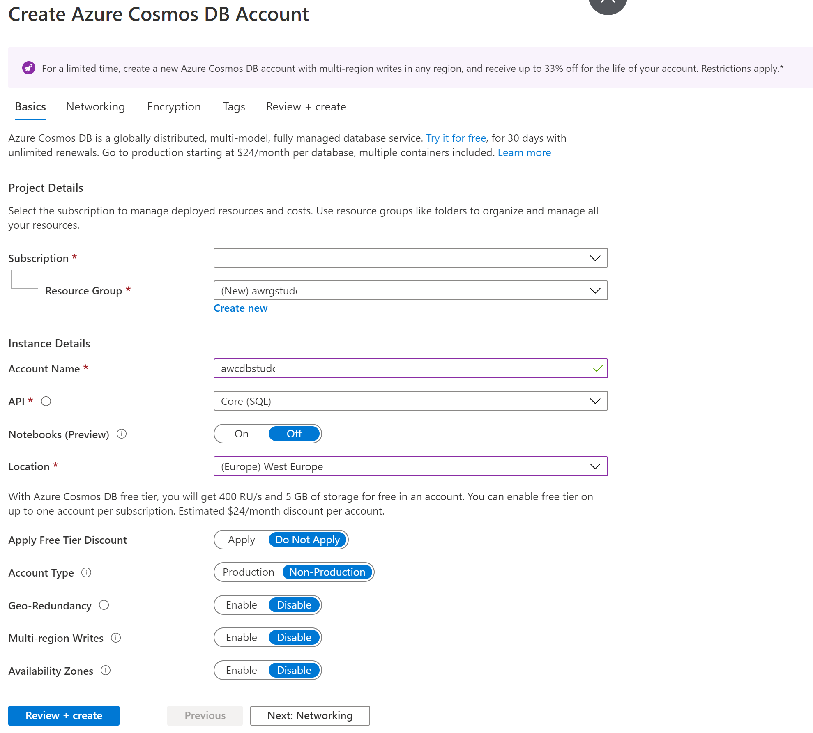
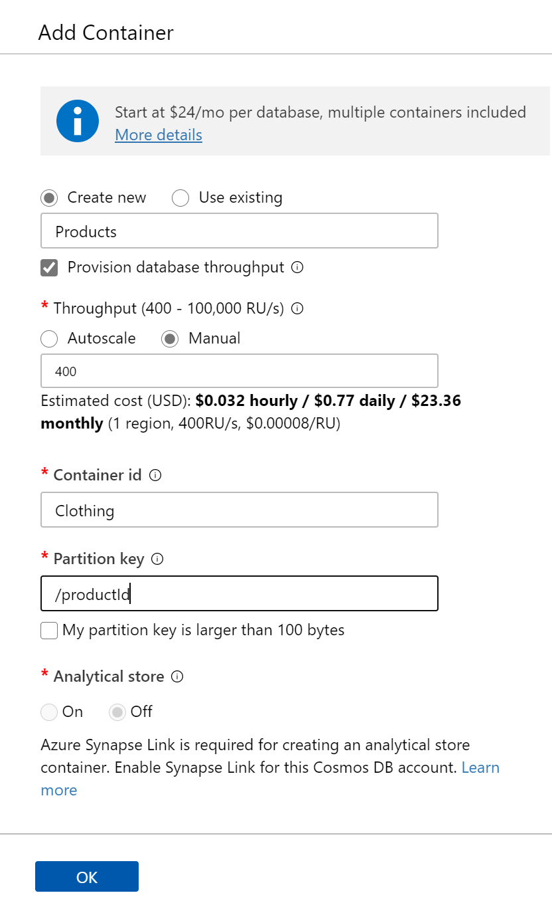
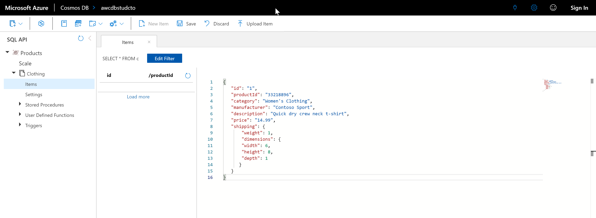
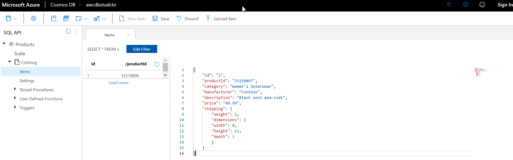
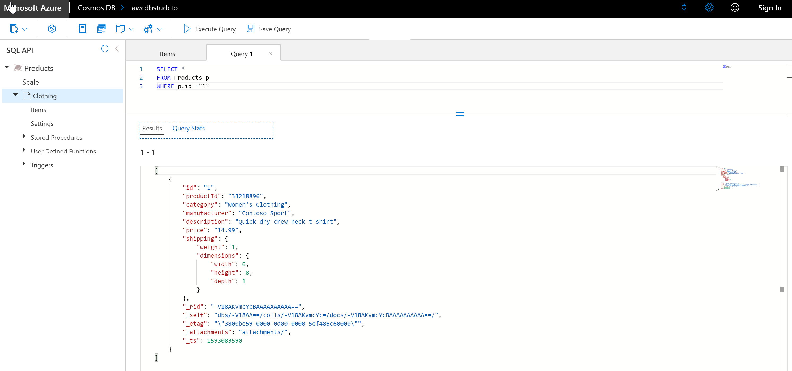
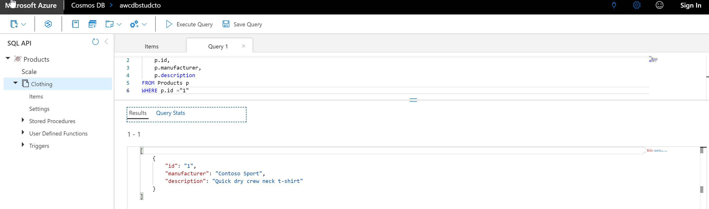
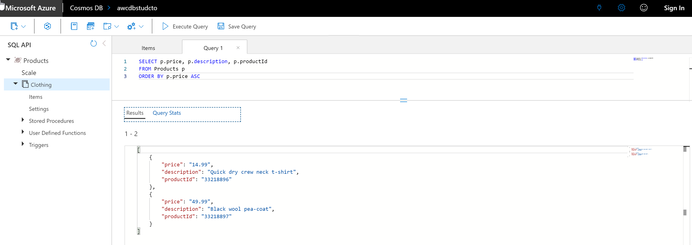
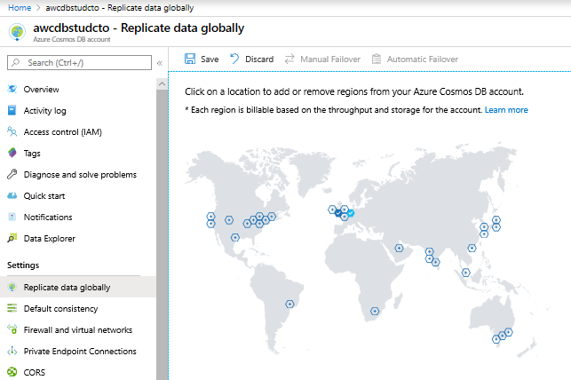
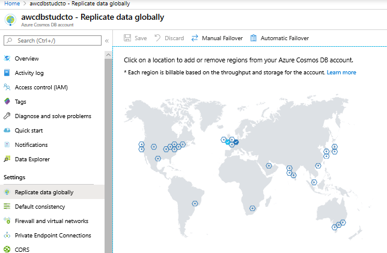

# Lab - Building Globally Distributed Databases with Cosmos DB

**Estimated Time**: 60 minutes

## Lab overview

The students will be able to describe and demonstrate the capabilities that Azure Cosmos DB can bring to an organization. They will be able to create a Cosmos DB instance and show how to upload and query data through a portal and through a .Net application. They will then be able to demonstrate how to enable global scale of the Cosmos DB database.

## Lab objectives
  
After completing this lab, you will be able to:

1. Create an Azure Cosmos DB database built to scale
1. Insert and query data in your Azure Cosmos DB database
1. Distribute your data globally with Azure Cosmos DB

## Scenario
  
The developers and Information Services department at AdventureWorks are aware that a new service known as Cosmos DB recently released on Azure can provided planetary scale access to data in near real-time. They want to understand the capability that the service can offer and how it can bring value to AdventureWorks, and in what circumstances.

The Information Services department want to understand how the service can be setup and how data can be uploaded. The developers would like to see an example of an application that can be used to upload data to the Cosmos. Both would like to understand how the claim of planetary scale can be met.

At the end of this lab, you will:

1. Created an Azure Cosmos DB database built to scale
1. Inserted and queried data in your Azure Cosmos DB database
1. Distributed your data globally with Azure Cosmos DB

## Exercise 1: Create an Azure Cosmos DB database built to scale

Estimated Time: 10 minutes

Individual exercise
  
The main task for this exercise are as follows:

1. Create an Azure Cosmos DB instance

### Task 1: Create an Azure Cosmos DB instance

1. In the Azure portal, if neccesary click on the **Home** hyperlink.

1. Navigate to the **+ Create a resource** icon.

1. In the New screen, click in the **Search the Marketplace** text box, and type the word **Cosmos**. Click **Azure Cosmos DB** in the list that appears.

1. In the **Azure Cosmos DB** screen, click **Create**.

1. From the **Create Azure Cosmos DB Account** screen, create an Azure Cosmos DB Account with the following settings:

    - In the Project details of the screen, type in the following information
    
        - **Subscription**: the name of the subscription you are using in this lab

        - **Resource group**: **awrgstudxx**, where **xx** are your initials

    - In the Instance details of the screen, type in the following information

        - **Account name**: **awcdbstudxx**, where **xx** are your initials.

        - **API**: **Core(SQL)**

        - **Notebooks (Preview)**: **Off**

        - **Location**: the name of the Azure region which is closest to the lab location and where you can provision Azure VMs.

        - Leave the remaining options to the default settings

            

1. In the **Create Azure Cosmos DB Account** blade, click **Review + create**.

1. After the validation of the **Create Azure Cosmos DB Account** blade, click **Create**.

   > **Note**: The provision will takes approximately 5 minutes. What is often avoided in these labs is a description of the additional tabs when you provision any service in Azure. You may notice that in the provisioning screen there will be additional tabs such as Network, Tags or Advanced. This enables you to define any customized settings for a service. For example, the network tab of many services enables you to define the configuration of virtual networks, so that you are able to control and secure the network traffic against a given data service. The Tags option  are name/value pairs that enable you to categorize resources and view consolidated billing by applying the same tag to multiple resources and resource groups. Advanced tabs will vary dependant on the service that has it. But it is important to note that you have control over these areas and you wil want to collaborate with your Network admins or indeed your finance department to see how these options should be configured.

1. When the provisioning is complete, the "Your deployment is complete" screen appears, click on **Go to resource** and move onto the next exercise. 

>**Result** In this exercise, you have provisioned an Azure Cosmos DB Account

## Exercise 2: Insert and query data in your Azure Cosmos DB database
  
Estimated Time: 20 minutes

Individual exercise
  
The main tasks for this exercise are as follows:

1. Setup your Azure Cosmos DB database and container 

1. Add data using the portal

1. Run queries in the Azure portal

1. Run complex operations on your data

### Task 1: Setup your Azure Cosmos DB container and database

1. In the Azure portal, once the deployment of Cosmos DB is completed, click on the **Go to resources** button.

1. In the Cosmos DB screen,  click on the **Overview** link.

1. In the **awcdbstudxx** screen, click **+ Add Container**. This opens up the **awcdbstudxx Data Explorer** screen with the **Add Container** blade.

1. In the **Add Container** blade, create a Products database with a container named Clothing with the following settings:

    - **Database id**: **Products**
    
    - **Throughput**:  **400**

    - **Container id**:  **Clothing**

    - **Partition key**: **/productId**

    - Leave the remaining options with their default values

        

1. In the **Add Container** screen, click **OK**

### Task 2: Add data using the portal

1. In the **awcdbstudcto - Data Explorer** screen, on the Data Explorer toolbar, opposite the button for New Container, click on the **Open Full Screen** button. In the Open Full Screen dialog box, click **Open**. A new tab opens up in Microsoft Edge.

1. In the **SQL API** pane, click in the refresh icon, and then expand **Products**, followed by **Clothing** and click on **Items**. 

1. In the Documents pane, click on the icon for **New Item**. A new document appears with a sample JSON that you will now replace.

1. Copy the following code and paste it into the **Documents** tab:

    ```JSON
    {
       "id": "1",
       "productId": "33218896",
       "category": "Women's Clothing",
       "manufacturer": "Contoso Sport",
       "description": "Quick dry crew neck t-shirt",
       "price": "14.99",
       "shipping": {
           "weight": 1,
           "dimensions": {
           "width": 6,
           "height": 8,
           "depth": 1
          }
       }
    }
    ```

    

1. Once you've added the JSON to the Documents tab, click **Save**.

1. In the Documents pane, click on the icon for **New Item**.

1. Copy the following code and paste it into the **Items** tab:

    ```JSON
    {
        "id": "2",
        "productId": "33218897",
        "category": "Women's Outerwear",
        "manufacturer": "Contoso",
        "description": "Black wool pea-coat",
        "price": "49.99",
        "shipping": {
            "weight": 2,
            "dimensions": {
            "width": 8,
            "height": 11,
            "depth": 3
            }
        }
    }
    ```

    

1. Once you've added the JSON to the Documents tab, click **Save**.

1. You can see each document that has been saved by clicking each document on the left-hand menu. The first item with id of 1, will have a value of **33218896**, which is named after the productid, the second item will be **33218897**

### Task 3: Run queries in the Azure portal.

1. In the Azure portal, in the **Items** screen, click on the button **New SQL Query** that is above the **SQL API** Blade, above the **refresh** icon.

    > **Note**: A Query 1 screen tab appears which shows the query **SELECT * FROM c** .

1. Replace the query that returns a JSON file showing details for productId 1.

    ```SQL
    SELECT *
    FROM Products p
    WHERE p.id ="1"
    ```

1. Click on the **Execute Query** icon. The following result is returned

    ```JSON
    [
        {
            "id": "1",
            "productId": "33218896",
            "category": "Women's Clothing",
            "manufacturer": "Contoso Sport",
            "description": "Quick dry crew neck t-shirt",
            "price": "14.99",
            "shipping": {
                "weight": 1,
                "dimensions": {
                    "width": 6,
                    "height": 8,
                    "depth": 1
                }
            },
            "_rid": "I2YsALxG+-EBAAAAAAAAAA==",
            "_self": "dbs/I2YsAA==/colls/I2YsALxG+-E=/docs/I2YsALxG+-EBAAAAAAAAAA==/",
            "_etag": "\"0000844e-0000-1a00-0000-5ca79f840000\"",
            "_attachments": "attachments/",
            "_ts": 1554489220
        }
    ]
    ```

    

1. In the existing query window. Write a query that returns the id, manufacturer and description in a JSON file for productId 

    ```SQL
    SELECT
        p.id,
        p.manufacturer,
        p.description
    FROM Products p
    WHERE p.id ="1"
    ```

1. Click on the **Execute Query** icon. The following result is returned

    ```JSON
    [
    {
        "id": "1",
        "manufacturer": "Contoso Sport",
        "description": "Quick dry crew neck t-shirt"
    }
    ]
    ```

    

1. In the existing query window, write a query that returns returns the price, description, and product ID for all products, ordered by price, in ascending order.

    ```SQL
    SELECT p.price, p.description, p.productId
    FROM Products p
    ORDER BY p.price ASC
    ```

1. Click on the **Execute Query** icon. The following result is returned

    ```JSON
    [
        {
            "price": "14.99",
            "description": "Quick dry crew neck t-shirt",
            "productId": "33218896"
        },
        {
            "price": "49.99",
            "description": "Black wool pea-coat",
            "productId": "33218897"
        }
    ]
    ```

    

### Task 4: Run complex operations on your data

1. In the Azure portal, in the **Items** screen, click on the button **New Stored Procedure**.

    > **Note**: A New Stored Procedure screen appears which shows a sample stored procedure .

1. In the New Stored Procedure screen, in the **Stored Procedure Id** text box, type **createMyDocument**.

1. Use the following code to create a stored procedure in the Stored Procedure Body.

    ```Javascript
    function createMyDocument() {
        var context = getContext();
        var collection = context.getCollection();

        var doc = {
            "id": "3",
            "productId": "33218898",
            "description": "Contoso microfleece zip-up jacket",
            "price": "44.99"
        };

        var accepted = collection.createDocument(collection.getSelfLink(),
            doc,
            function (err, documentCreated) {
                if (err) throw new Error('Error' + err.message);
                context.getResponse().setBody(documentCreated)
            });
        if (!accepted) return;
    }
    ```

1. In the New Stored Procedure screen, click **Save**.

1. In the New Stored Procedure screen, click **Execute**.

1. In the Input Parameters screen, **type** should be set to **string**, and **value** set to  **33218898** in the **Partition Key Value** text box, and then click **Execute**.

The following result is returned

    ```JSON
    {
        "id": "3",
        "productId": "33218898",
        "description": "Contoso microfleece zip-up jacket",
        "price": "44.99",
        "_rid": "I2YsALxG+-EDAAAAAAAAAA==",
        "_self": "dbs/I2YsAA==/colls/I2YsALxG+-E=/docs/I2YsALxG+-EDAAAAAAAAAA==/",
        "_etag": "\"0000874e-0000-1a00-0000-5ca7a7050000\"",
        "_attachments": "attachments/"
    }
    ```

1. In the Azure portal, in the Data Explorer full screen, click on the drop down button for **New Stored Procedure** and click **New UDF** .

    > **Note**: A New UDF 1 screen appears which shows **function userDefinedFunction(){}**

1. In the New Defined Function screen, in the **User Defined Function Id** text box, type **producttax**.

1. Use the following code to create a user defined function in the user defined function Body.

    ```Javascript
    function producttax(price) {
        if (price == undefined) 
            throw 'no input';

        var amount = parseFloat(price);

        if (amount < 1000) 
            return amount * 0.1;
        else if (amount < 10000) 
            return amount * 0.2;
        else
            return amount * 0.4;
    }
    ```

1. In the New UDF 1 screen, click **Save**.

1. Click on the Query 1 tab, and replace the existing query with the following query:

    ```SQL
    SELECT c.id, c.productId, c.price, udf.producttax(c.price) AS producttax FROM c
    ```

1. In the Query 1 screen, click **Execute Query**.

The following result is returned

    ```JSON
    [
        {
            "id": "1",
            "productId": "33218896",
            "price": "14.99",
            "producttax": 1.499
        },
        {
            "id": "2",
            "productId": "33218897",
            "price": "49.99",
            "producttax": 4.9990000000000005
        },
        {
            "id": "3",
            "productId": "33218898",
            "price": "44.99",
            "producttax": 4.4990000000000005
        }
    ]
    ```

## Exercise 3: Distribute your data globally with Azure Cosmos DB

Estimated Time: 15 minutes

Individual exercise

The main tasks for this exercise are as follows:

1. Replicate Data to Multiple Regions

1. Managing Failover

### Task 1: Replicate Data to Multiple Regions

1. In Microsoft Edge, click on the tab that states **awcdbstudxx - Data Explorer..**.

1. If a message appears that states "Connection error", click on the button **Refresh**.

1. In the **awcdbstudxx - Data Explorer** window, in the blade,  click on **Replicate data globally**.

    

1. On the world map, single click a data center location within the continent you reside, and click on **Save**.

>**Note**  The provisioning of the additional data centers will take approximately 7 minutes

### Task 2: Managing Failover.

1. In the **awcdbstudxx - Replicate data globally** window, click on **Manual Failover**.

1. Click on the **Read Region** datacenter location, then click on the check box next to "I understand and agree to trigger a failover on my current Write Region.", and then click on **OK**.

>**Note**  The Manual Failover will take approximately 3 minutes. The screen will look as follows. Note the icon colors have changed



1. In the **awcdbstudxx - Replicate data globally** window, click on **Automatic Failover**

1. In the "Automatic Failover" screen, click on the **ON** button, and then click on **OK**.

>**Note**  The provisioning of the Automatic Failover will take approximately 3 minutes.


